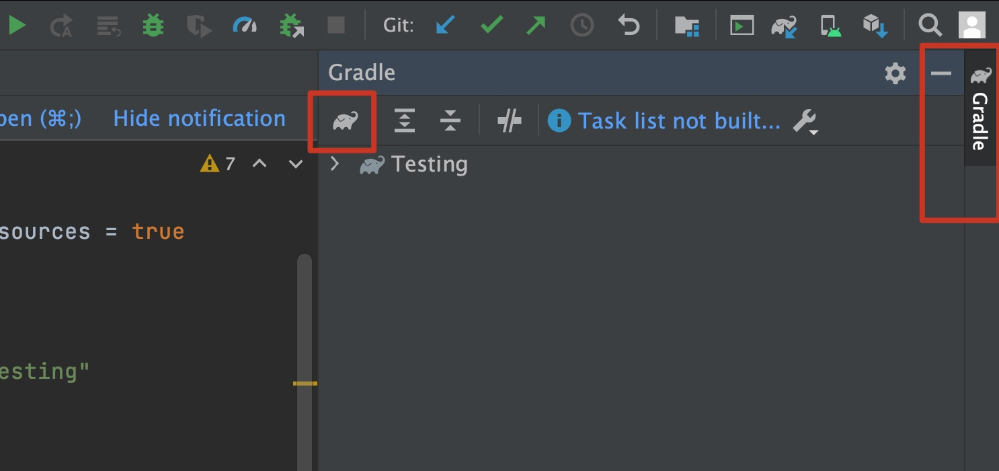
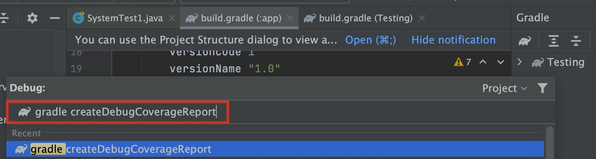
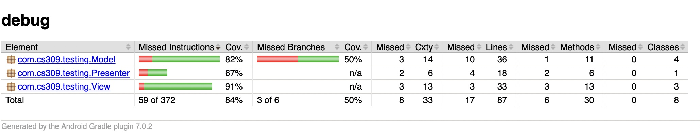
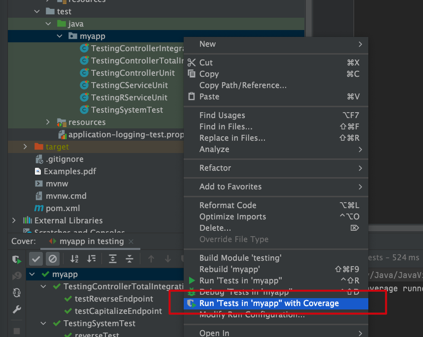
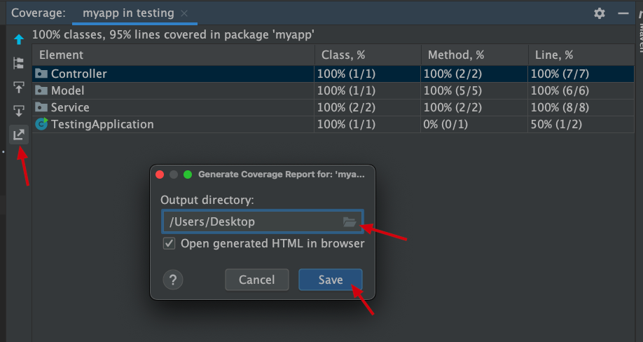
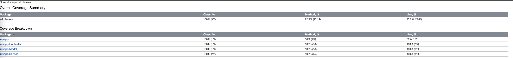

# Which files are system tests:

#### Backend
- `Backend->testing->src->test->java->myapp->TestingSystemTest.java`

#### Frontend
- regular activity tests: `Frontend->Testing->app->src->androidTest->java->com->cs309->testing->SystemTest.java`
- simple intent (with extra) test: `Frontend->IntentTest->app->src->androidTest->java->com->example->intenttest->SystemTest.java`
- simple fragment tests: `Frontend->FragmentTest->app->src->androidTest->java->com->example->myapplication->SystemTest.java`
- simple side-navigation tests: `Frontend->NavigationTest->app->src->androidTest->java->com->example->navigationtest->SystemTest.java`

**Note: in the example, the backend must be running for frontend tests to pass.**

[View the demos](./demo)

----

# Example Versions:
```json:table
{
    "fields" : ["Android-Gradle", "Android-Gradle-Plugin", "Springboot"],
    "items" : [
        {
            "Android-Gradle": "8.0", 
            "Android-Gradle-Plugin": "8.1.2", 
            "Springboot": "3.1.4"
        }
    ]
}
```

----

# Relevent Dependencies:
```groovy
// for Android
    testImplementation 'junit:junit:4.13.2'
    androidTestImplementation 'com.android.support.test:rules:1.0.2'
    androidTestImplementation 'com.android.support.test:runner:1.0.2'
    androidTestImplementation 'androidx.test.ext:junit:1.1.5'
    androidTestImplementation 'androidx.test.espresso:espresso-core:3.5.1'
    androidTestImplementation 'androidx.test.espresso:espresso-contrib:3.4.0'
    androidTestImplementation 'androidx.test.espresso:espresso-intents:3.4.0'
```

```xml
// for Springboot
    <dependency>
        <groupId>org.springframework.boot</groupId>
        <artifactId>spring-boot-starter-test</artifactId>
    </dependency>
    <dependency>
        <groupId>io.rest-assured</groupId>
        <artifactId>rest-assured</artifactId>
        <scope>test</scope>
    </dependency>
    <dependency>
        <groupId>junit</groupId>
        <artifactId>junit</artifactId>
        <version>4.13.2</version>
        <scope>test</scope>
    </dependency>
```

----

# Frontend Coverage Report

1. add to your `build.gradle(Module: app)` (inside buildTypes)
```groovy
debug{
    testCoverageEnabled true
}
```
so that it looks like this 
```groovy
 buildTypes {
    debug{
        testCoverageEnabled true
    }

    ... (other things)
}
```

2. click on `sync now` to update the project

3. make sure you have your Android enmulator up and running

4. in Android Studio, open Gradle tab on the right, hit the 'Gradle icon' to type in commands



5. type in `createDebugCoverageReport` and hit 'Enter'



6. once it runs through, find the coverage report in: `/tutorials/Frontend/Testing/app/build/reports/coverage/androidTest/debug/index.html`

7. it should look something like:




[source](https://stackoverflow.com/questions/33393871/how-to-obtain-coverage-for-android-project-using-espresso-tests)


# Backend Coverage Report

1. in IntelliJ -> project structure, right click on the test directory

2. run all tests with coverage



Note: if `No coverage results` 
- reason: the package name in `test/java` is different from the project's actual package name in `main/java`.
- fix: 
    - refactor the package name to match what you have under `main/java`.
    - or, click `Edit` to fix configuration settings -> Under `Packages and classes to include in coverage data` -> select the actual package in `main/java` for coverage.

3. save the coverage report to a directory



4. expect to get a similar example to the following:



[source](https://www.jetbrains.com/help/idea/generating-code-coverage-report.html)


